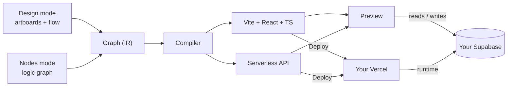

<div align="center">

# loomJS

**A visual programming language with Figma-style design tools — build full-stack web apps by designing and wiring, never by writing syntax.**


-868D97)


</div>

---

## What is loomJS?

loomJS lets designers build full-stack, data-driven web apps the way they already work — on a
canvas. You **design the interface** on artboards and **wire visual nodes** for the logic behind
it. There's no syntax to learn: functions are node cards, data flow is drag-and-drop wires, and
"compiling" turns your visual graph into a **real, runnable, fully-owned codebase**.

The core promise is simple: *a designer should never feel they left the canvas.*

Under the hood, your graph is an **intermediate representation** that a compiler emits into a
real **Vite + React + TypeScript** frontend and **serverless API** backend, wired to your **own**
database. You own the code, the database, and the deployment — nothing is locked inside loomJS.

> **loomJS is not another app builder that traps you in a runtime.** It's a language that compiles
> to real code you can read, edit, and ship anywhere.

---

## How it works

### One canvas, two modes

- **Design mode** — a Figma-style UI and user-flow editor (frontend only). Drag components onto
  artboards, style them in a schema-driven inspector, and draw flow arrows between screens.
- **Nodes mode** — the backend graph. Wire UI, Function, API, State, and Database nodes
  port-to-port into pipelines. Color tells you the type; wires tell you the flow.

Every component you place on an artboard automatically gets a mirror node in the graph, so the
thing you designed and the logic behind it are always connected.

### Bring Your Own Backend (BYO-backend)

loomJS owns the **building experience**; you own the **running app's infrastructure**. You
connect **your own Supabase** (database + auth) and deploy to **your own Vercel**. loomJS never
hosts your data — it generates the app and wires it to your stack.

### Compile → Preview → Deploy



**Preview** runs the compiled app live against a dev database. **Deploy** ships the generated
repo to your host. What you get is a normal, professional React/TypeScript project.

---

## Design philosophy

loomJS is a **domain-specific** visual language for data-driven web apps — forms, CRUD,
dashboards, and auth — *not* a general-purpose one. General-purpose visual programming becomes
unreadable the moment logic gets real, so loomJS keeps its node vocabulary small and honest:
the common 80% is expressed as clean nodes, and the arbitrary 20% drops into a **Code node**
(typed ports, hand-written TypeScript) without breaking the metaphor.

Everything is built on a few recurring ideas: **nodes are functions**, **wires are data flow**,
**flow arrows are navigation**, and **compile means generate real code**. Color is functional —
each node category owns one hue, so you read a graph by color first.

---

## Tech stack

| Layer | Choice |
| --- | --- |
| **Generated frontend** | Vite + React + TypeScript (SPA), react-router |
| **Generated backend** | Serverless functions (Vercel `/api`) |
| **Generated styling** | Tailwind, with shadcn/ui as the flagship component kit |
| **Your database + auth** | Supabase (Postgres, relational) — you connect your own |
| **Deploy target** | Vercel (managed) — your own account |
| **The compiler** | Node.js — walks the graph, emits real code from templates |
| **Type layer** | TypeScript throughout; Supabase-generated types as the data spine |
| **Platform (loomJS itself)** | Supabase (accounts + metadata) · Cloudflare R2 (project storage) |

---

## Project status

loomJS is in **early development, heading toward a closed beta**. The visual editor exists as an
interactive prototype; the compiler that emits a running app is the current focus. It is **not
yet publicly available** — access will open in stages, and the project is intended to become
**open-source** once the core is stable.

### Roadmap (V1)

The V1 pipeline: **design + flow → backend nodes → Supabase → Preview → Vercel deploy.**

- [ ] **M0** — Compiler skeleton: graph → a real Vite/React repo that builds and runs
- [ ] **M1** — Editor ↔ compiler ↔ Preview (the core loop)
- [ ] **M2** — Flow arrows compile to routing
- [ ] **M3** — Backend graph compiles to serverless functions
- [ ] **M4** — Supabase connector: schema introspection → typed nodes + auth
- [ ] **M5** — Auto-backend: design a form, the backend materializes pre-wired
- [ ] **M6** — Vercel deploy + a full sample app, end to end
- [ ] **Platform** — accounts, workspaces, projects (built alongside the milestones)

### Planned beyond V1

Git-style async collaboration (branch / merge / history), Next.js and container-deploy targets,
a public module marketplace, additional database connectors, reusable custom nodes, and — much
later — mobile output. See [`docs/03-system-memory.md`](docs/03-system-memory.md) for the full
deferred list with reasoning.

---

## Documentation

This repository carries a full context suite for both humans and AI coding agents:

| File | Purpose |
| --- | --- |
| [`docs/01-system-context.md`](docs/01-system-context.md) | Vision, BYO-backend, the two modes |
| [`docs/02-system-architecture.md`](docs/02-system-architecture.md) | Layers, compiler, connectors, storage |
| [`docs/03-system-memory.md`](docs/03-system-memory.md) | Decision log — settled / deferred / open |
| [`docs/04-hallucination-check.md`](docs/04-hallucination-check.md) | Verification protocol + rejected traps |
| [`docs/05-guardrails.md`](docs/05-guardrails.md) | Hard constraints (security, scope, design) |
| [`docs/06-glossary.md`](docs/06-glossary.md) | Canonical terminology |
| [`docs/07-v1-scope.md`](docs/07-v1-scope.md) | V1 in/out line + build order |
| [`docs/08-flows.md`](docs/08-flows.md) | System, platform, canvas & logic flow diagrams |

**Working with an AI agent?** `CLAUDE.md` (Claude Code) and `AGENTS.md` (Antigravity / Cursor)
are the entry points; always-on rules live in `.agents/rules/`. They route into `/docs`.

---

## Running it locally

Node 20+ and pnpm 8. Everything below runs offline — no Supabase project, no account, no keys.

```bash
pnpm install
pnpm --filter @loom/studio dev      # http://localhost:5173
```

That one command is the whole system. The studio starts a **second** Vite server on **5174** for
the Preview: the editor compiles your project in the browser, posts the emitted files to the dev
server, and the child server serves them into the iframe. What you see previewed is real compiler
output, not a simulation.

Workspace packages resolve to their TypeScript source, so **there is no build step** before running
or testing. `pnpm build` exists for CI and for typechecking; you do not need it to work on the app.

### Try it in two minutes

1. Select **Root** in the elements tree, then place a **Text field**, a **Button** and a **Text**
   from the palette below it.
2. Switch to **Nodes** on the icon rail. Add an **API route**, then a **Compute** inside it (adding
   a function node while a route is selected puts it in the route's body — the container boundary
   is the network boundary).
3. Wire the button's `onClick` into the route's `run`, the field's `value` into its `input`, and
   its `result` into the Text's `content`.
4. Type in the Preview and press the button. The answer came from an emitted serverless function
   running on the child server.

### The database, without a database

The connector work is exercised by a stub that speaks PostgREST's protocol, so nothing needs to be
provisioned:

```bash
node apps/studio/e2e/stub-postgrest.mjs     # http://localhost:5412
```

Then in the studio: **Data** on the icon rail → *Connect* → URL `http://localhost:5412`, any
non-empty keys. To point at a real Supabase project instead, run `pnpm setup:supabase` (it writes
`apps/studio/.env.local`, which is git-ignored and never enters the project file).

## Testing

Four layers, fastest first. Only the last two are slow.

```bash
# 1. Unit — the compiler, the IR, the editor's state (~360 tests, seconds)
pnpm test -- --concurrency=1

# 2. Types and lint
pnpm typecheck && pnpm lint

# 3. End-to-end — the real editor, driven by Playwright (~53 specs, ~2 min)
npx playwright install          # once
pnpm --filter @loom/studio test:e2e

# 4. Smoke gates — emit a project, `npm install` it, and build it for real (~3 min)
pnpm --filter @loom/compiler test:smoke
```

**`--concurrency=1` on the unit tests is not optional on Windows**: turbo's parallel fan-out
crashes the Vitest workers. It is a known issue with the runner, not with the tests.

The **smoke gates are the ones that matter most** and the reason to tolerate their cost. Each one
writes a project to a temp directory, installs its dependencies, and runs the emitted app's own
`tsc` and Vite build — including a Supabase-shaped backend answering real requests. String matching
in a unit test will happily accept TSX that does not compile; these will not.

Individual suites:

```bash
pnpm --filter @loom/compiler test                       # one package
pnpm --filter @loom/studio exec playwright test tree.spec.ts   # one spec
pnpm --filter @loom/studio exec playwright test --ui           # watch it drive the editor
```

The E2E run starts the studio, the Preview server and the PostgREST stub itself, and refuses to
reuse an existing one — a server left over from an earlier run answers happily while serving code
from before the change under test, which is worse than a failure.

---

## For contributors

Because loomJS spans a compiler, a visual editor, and several external platforms, a few
principles keep the project coherent — please read them before contributing:

- **Stay on the metaphors.** Design mode is frontend-only; Nodes mode is the backend graph.
  Nodes are functions, wires are flow, compile generates real code.
- **Respect the scope ceiling.** loomJS is a domain-specific language. If something pushes toward
  general-purpose visual programming, it belongs in a Code node.
- **Secrets are server-only, always.** Credentials never touch the project file, the repo, or the
  browser. (See [`docs/05-guardrails.md`](docs/05-guardrails.md).)
- **Verify external APIs** against live docs before relying on them; don't assume a capability.

Contribution guidelines and a formal `CONTRIBUTING.md` will land as the project opens up.

---

## License

Open-source licensing is **planned** but not yet finalized. Until a `LICENSE` file is added, all
rights are reserved. <!-- TODO: choose and add a license before public release -->

---

<div align="center">

<sub>Built on the Modernist design system · Archivo + JetBrains Mono · designed for designers.</sub>

<!--
TODO before publishing:
- Confirm the project name casing ("loomJS") and add a logo/banner image at the top.
- Add the access / waitlist link once it exists.
- Pick a license and replace the License section + add a LICENSE file.
- Replace shields.io badges with real CI/version badges once those pipelines exist.
-->

</div>