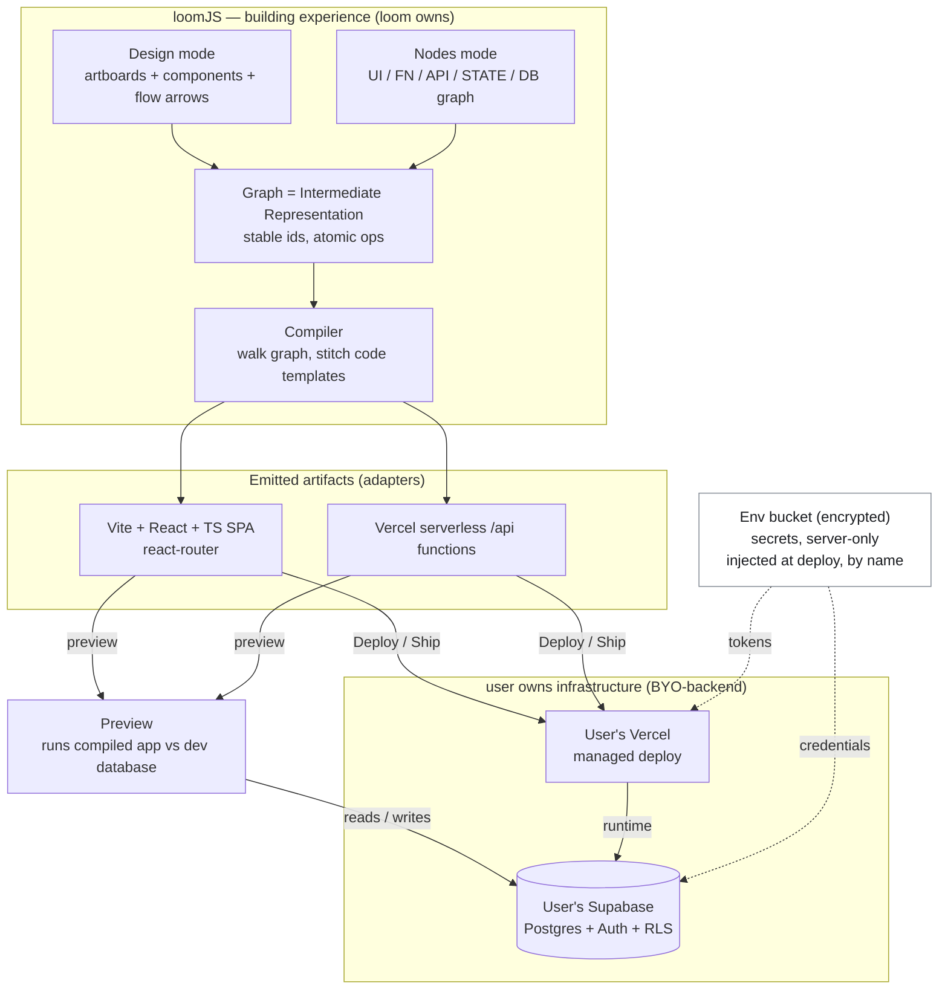
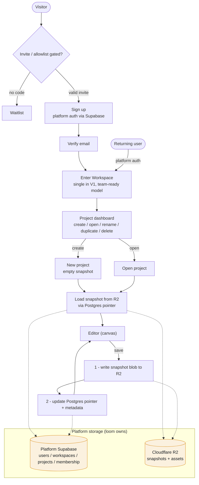
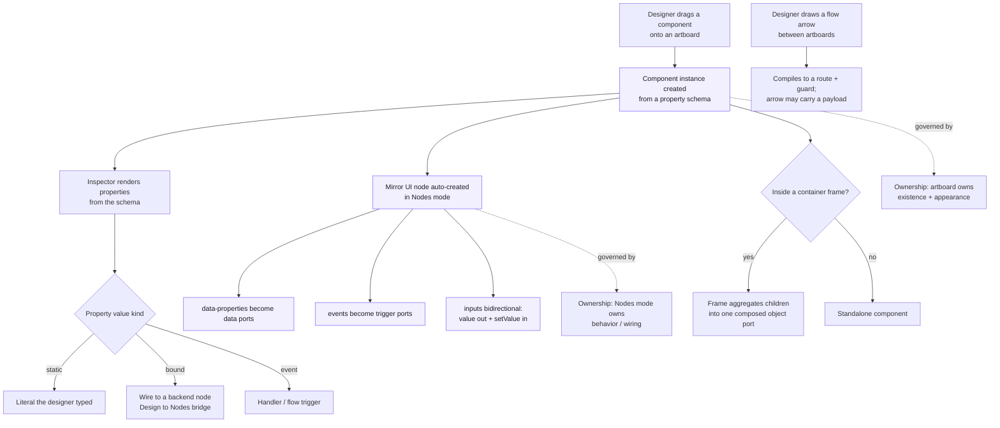
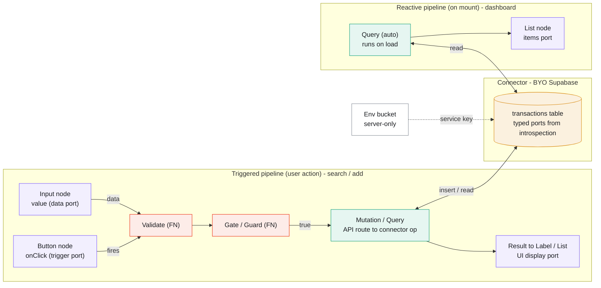

# 08 — Flow Diagrams

> Mermaid diagrams of the four core flows. They render on GitHub, in VS Code / Antigravity
> with a Mermaid preview, and in any Mermaid-aware viewer. Node fills use the loomJS category
> palette (UI violet, FN red, API teal, State blue, DB amber). These diagrams follow the
> decisions in `02-system-architecture.md` and `03-system-memory.md` — if they ever conflict,
> those docs win.

---

## 1. System flow — the end-to-end pipeline

The macro loop: the graph is an intermediate representation the compiler emits into a real
owned repo; the app runs on the **user's own** Supabase + Vercel (BYO-backend); secrets stay
server-only in the env bucket.

---

## 2. Platform flow — account & project lifecycle

Gated signup → workspace → project dashboard → editor. Snapshots live in R2; queryable
metadata + the R2 pointer live in the platform's own Supabase. Save order is **R2 blob first,
then the Postgres pointer** (an orphan blob is harmless; a dangling pointer is not).

---

## 3. Canvas flow — Design mode → component becomes node

Placing a component instantiates a **property schema** (the inspector renders from it) and
auto-creates a **mirror UI node** in Nodes mode whose ports derive from that schema. Flow
arrows compile to routes. Ownership is one-way: the artboard owns existence + appearance;
Nodes mode owns behavior.

---

## 4. Logic flow — Nodes mode data flow (triggered + reactive)

Data flows along wires through the FN vocabulary into the connector and back to the UI. Two
trigger modes coexist on one screen: **triggered** (fires on an event port — search / add) and
**reactive** (runs on mount — the dashboard list). The connector exposes typed per-table nodes
from introspection; the service key reaches it only from the server side (env bucket).

---

## Palette legend

| Category | Stroke | Tint |
| --- | --- | --- |
| UI node | `#7C5CFF` | `#F2EFFE` |
| Function (FN) | `#EC3013` | `#FDECE8` |
| API route | `#12A07A` | `#E6F6F1` |
| State | `#2F7DE1` | `#E9F1FD` |
| Database (DB) | `#D98A12` | `#FBF1DF` |
| Env / neutral | `#868D97` | `#FFFFFF` |
